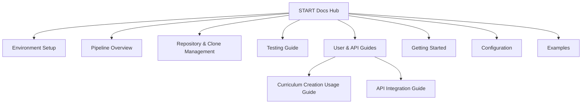

# START Project Documentation Hub

Welcome to the START (Scalable, Tailored Active-inference Research & Training) documentation.

- [Getting Started](getting_started.md)
- [Environment Setup](environment.md)
- [Pipeline Overview](pipeline.md)
- [Configuration](configuration.md)
- [Examples](examples.md)
- [Repository & Clone Management](clones.md)
- [Testing Guide](TESTING.md)

## Quick Links

- Learning Guides:
  - [Curriculum Creation Usage Guide](learning/curriculum_creation/USAGE_GUIDE.md)
  - [API Integration Guide](learning/curriculum_creation/README.md)
- Configuration Reference:
  - `data/config/entities.yaml`
  - `data/config/domains.yaml`
  - `data/config/languages.yaml`
- Prompt Templates:
  - `data/prompts/research_domain_analysis.md`
  - `data/prompts/research_domain_curriculum.md`
  - `data/prompts/research_entity.md`
  - `data/prompts/translation.md`

Fallback links:

- [Environment Setup](environment/)
- [Pipeline Overview](pipeline/)
- [Repository & Clone Management](clones/)
- [Testing Guide](TESTING/)
- [Curriculum Creation Usage Guide](learning/curriculum_creation/USAGE_GUIDE/)
- [API Integration Guide](learning/curriculum_creation/README/)
- [Getting Started](getting_started/)
- [Configuration](configuration/)
- [Examples](examples/)
