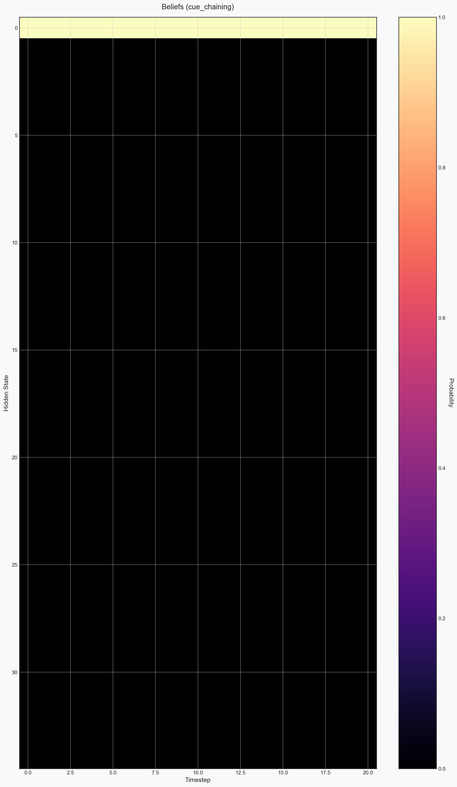
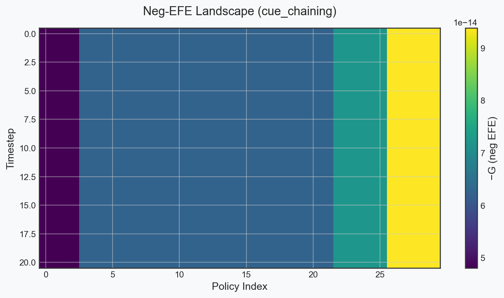

# docxology

> **Standalone Validation & High-Fidelity Orchestration for [pymdp](https://github.com/infer-actively/pymdp)**

Docxology is a specialized validation sidecar designed to provide **independent confirmation** and **zero-mock verification** for Active Inference agents. It exercises the full `pymdp` API surface—from basic state inference to hierarchical planning and MCTS—ensuring every mathematical artifact is verified against real execution traces.

---

## 🚀 High-Fidelity Validation

Docxology doesn't just run tests; it archives the **thermodynamic signatures** of Active Inference. Every simulation produces high-fidelity visual and numeric diagnostics.

<p align="center">
  
  
  <br>
  <em>Left: Posterior Belief Heatmap q(s) over time. Right: Negative Expected Free Energy −G landscapes over policies and time.</em>
</p>

---

## 🛠 Subsystem Architecture

The validation architecture is built on a modular, **thin-orchestrator** pipeline that strictly separates configuration from execution logic.

| Subsystem | Role & Engineering Purpose |
| :--- | :--- |
| **[`run_all.py`](run_all.py)** | **Global Pipeline Orchestrator**: Executes every registered scenario, persists full tensor data, and generates visual reports. |
| **[`AGENTS.md`](AGENTS.md)** | **Machine-Readable Contract**: Defines the mathematical boundaries and Agentic interaction protocols for the sidecar. |
| **[`config/`](config/)** | **Orchestration Context**: [Environment & rigor settings](config/README.md) defining `--fast` vs. full-depth validation. |
| **[`docs/`](docs/)** | **Operator Index**: Complete documentation suite linking MkDocs guides to testable implementation targets ([Operator Index](docs/README.md)). |
| **[`examples/`](examples/)** | **Workload Taxonomy**: 32 core Active Inference scenarios grouped by mathematical domain ([Workload Catalog](examples/README.md)). |
| **[`pkg/`](pkg/)** | **Internal Support**: Utility functions for headless visualization, metric analysis, and model fixtures ([Package Specs](pkg/README.md)). |
| **[`manifests/`](manifests/)** | **Test Targets**: Strict registration lists in `.txt` format defining the CI/CD execution boundary. |
| **[`output/`](output/)** | **Diagnostic Artifacts**: Persistent store of JSON metrics, NPZ tensor traces, and publication-ready PNGs. |

---

## 🧪 Independent Confirmation & "Zero-Mock" Policy

The core of Docxology is its **Rule of Parity**: No mocked methods. No hallucinated benchmarks. 

Every result is derived from **real `pymdp` methods** running in isolated execution environments. When `run_all.py` executes, it triggers a 6-step post-processing pipeline:

1. **Construct Real Agent**: `pymdp.agent.Agent(A, B, C, D)`
2. **Execute Inference**: Real JAX/Equinox FPI, MMP, or VMP loops.
3. **Verify Invariants**: Automatic audit of probability normalization (sum-to-1 ±1e-3).
4. **Retroactive Analytics**: Automated derivation of Shannon entropy $H(q)$ and KL-Divergence.
5. **Tensor Archiving**: Unrestricted serialization of all arbitrary arrays into compressed `.npz` traces.
6. **Visual Reporting**: Automated generation of `{stem}_execution_report.md` with embedded visuals.

---

## ⚡ Quick Start

### 1. Repository Setup

Docxology is designed to work within the `pymdp` repository but can run in its own standalone virtual environment.

```bash
cd docxology
uv venv .venv
source .venv/bin/activate
uv sync --group test
```

### 2. Execution Pathways

```bash
# Full 32-example validation pipeline
uv run python run_all.py

# Structural pytest suite
uv run pytest tests/ -v

# Targeted notebook validation
uv run python scripts/run_docxology_notebooks.py --strict-output
```

---

## 📊 Performance Insights

Docxology automatically extracts terminal and mean scalar values across belief trajectories:

| Metric | Display Key | Mathematical Basis |
| :--- | :--- | :--- |
| **Shannon Entropy** | `H_qs` | $H(q) = - \sum q(s) \ln q(s)$ |
| **Variational Free Energy** | `vfe` / `F` | $F = \text{Complexity} - \text{Accuracy}$ |
| **Expected Free Energy** | `neg_efe` / `G` | $G \approx \text{Pragmatic Value} + \text{Information Gain}$ |
| **Belief Divergence** | `KL` | $D_{KL}(q \| p)$ from target prior |

---


## ⚠️ CI & Deployment Note

Running Docxology validation in hosted CI environments (like GitHub Actions) requires either a root execution workflow or an external pipeline. This sidecar serves as the **mathematical authority** for the repository, ensuring that every code change preserves the thermodynamic properties of the Active Inference implementations.
