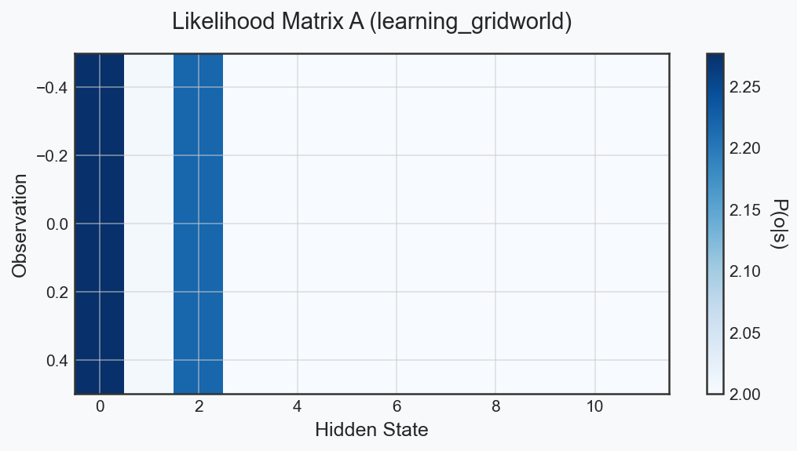

# Execution Report: learning_gridworld

## Configuration
- **Seed**: 0
- **Fast Mode**: True
- **Skip Heavy**: True

## Mathematical Invariants
- ❌ **Violations Detected:**
  - Likelihood matrix (A) does not sum to 1 over axis 0.

## Performance Insights
| Metric | Terminal Value | Mean Trajectory Value |
|---|---|---|
| *No scalar trace endpoints detected* | N/A | N/A |

## Native Trace Archive
A native complete JAX/NumPy parameter archive is available at [`learning_gridworld_model_trace.npz`](learning_gridworld_model_trace.npz).

## Visualizations
### Matrix A

