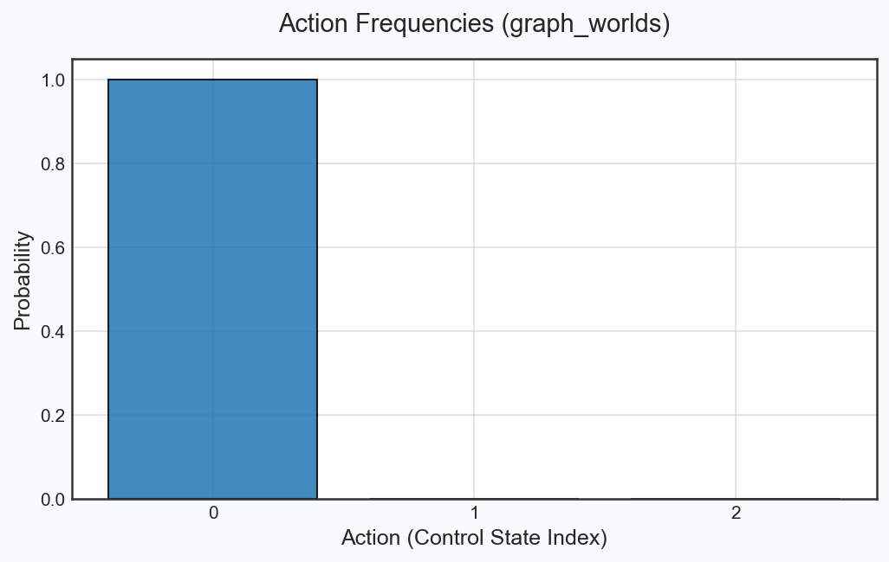
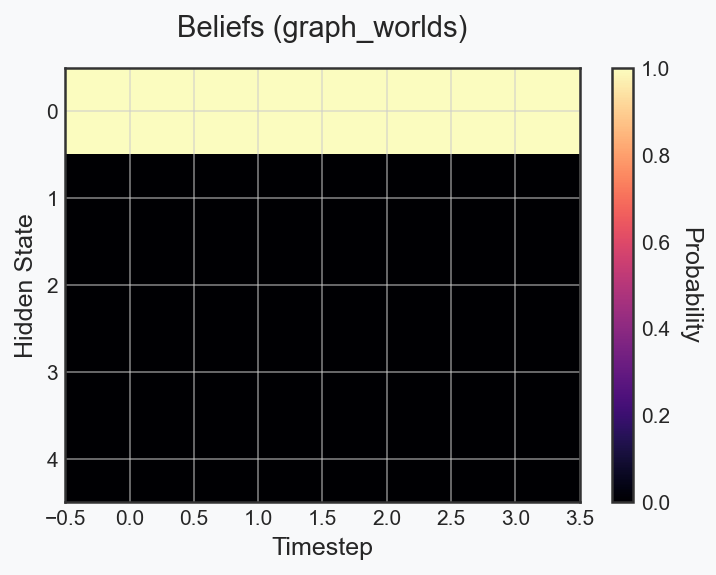
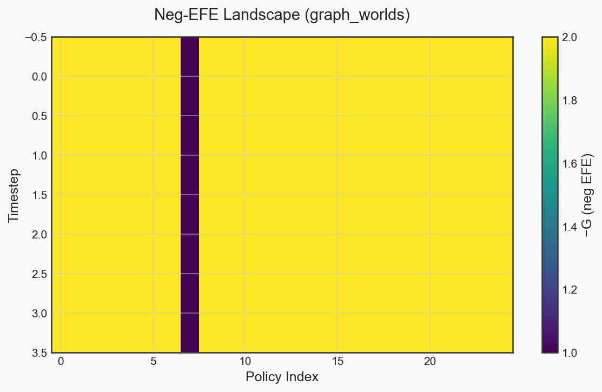
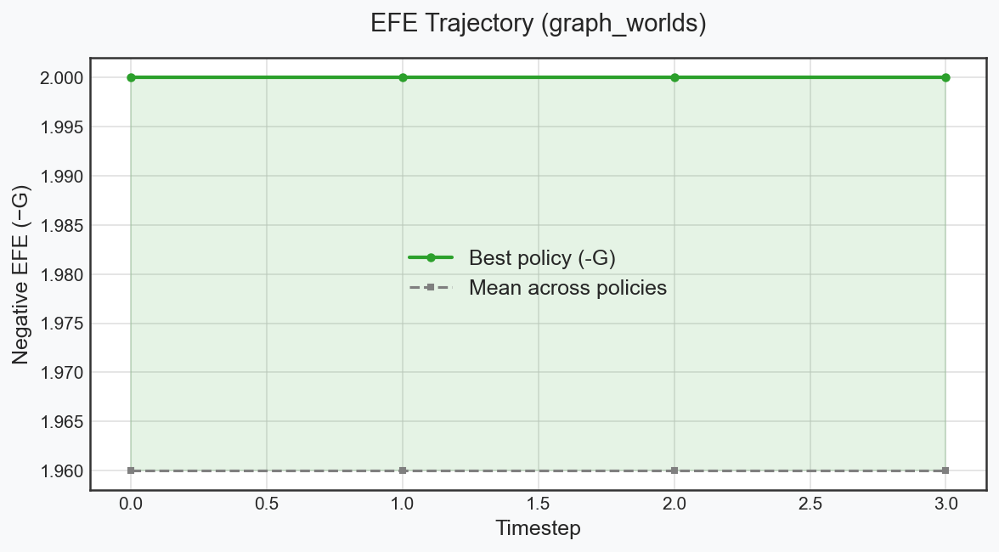
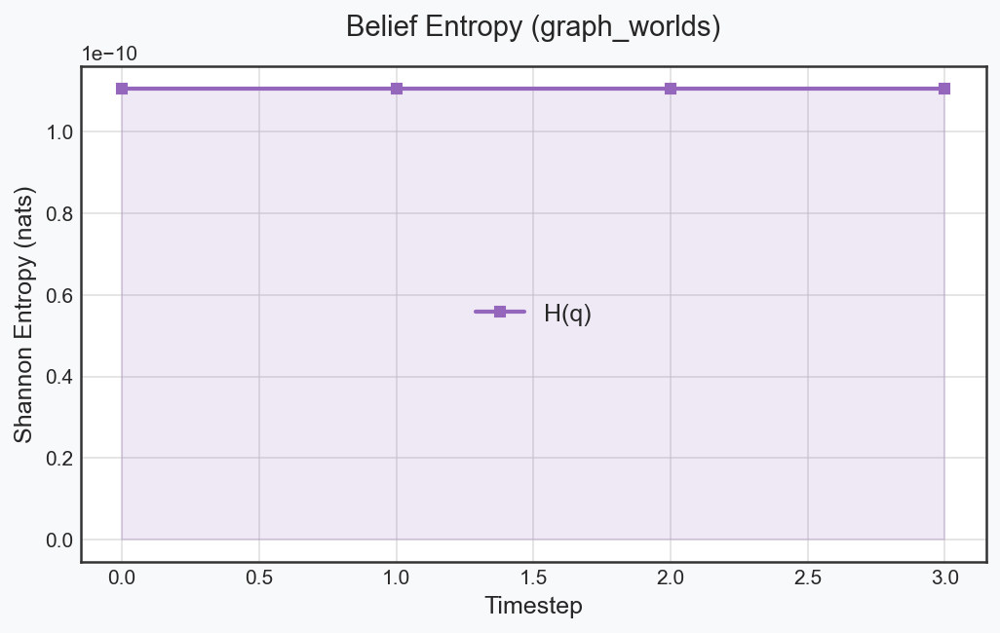
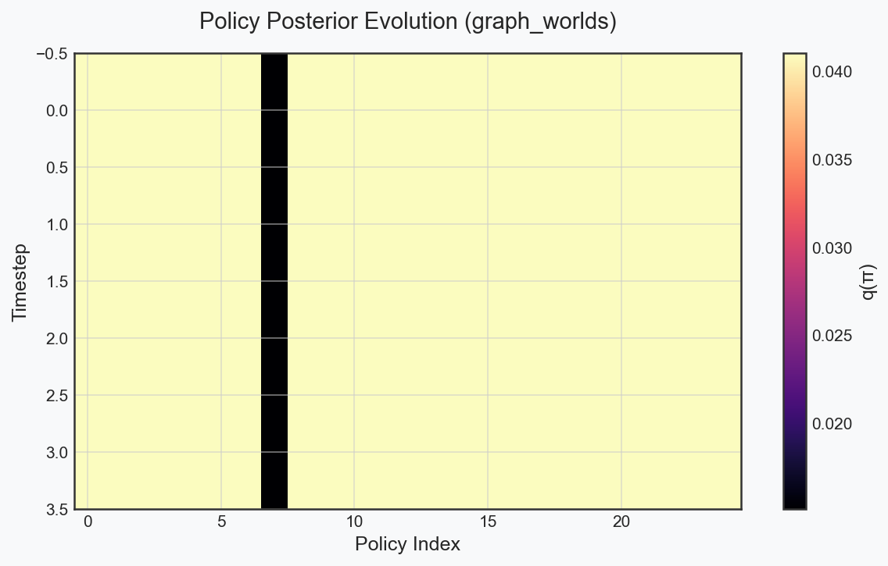

# Execution Report: graph_worlds

## Configuration
- **Seed**: 0
- **Fast Mode**: True
- **Skip Heavy**: True

## Mathematical Invariants
- ✅ **All probability bounds valid.**

## Performance Insights
| Metric | Terminal Value | Mean Trajectory Value |
|---|---|---|
| **Shannon Entropy $H(q)$** | 0.0000 | 0.0000 |
| **Negative Expected Free Energy $-G$** | 2.0000 | 1.9600 |

## Native Trace Archive
A native complete JAX/NumPy parameter archive is available at [`graph_worlds_model_trace.npz`](graph_worlds_model_trace.npz).

## Visualizations
### Actions

### Beliefs

### Efe Heatmap

### Efe Traj

### Entropy

### Qpi Heatmap

